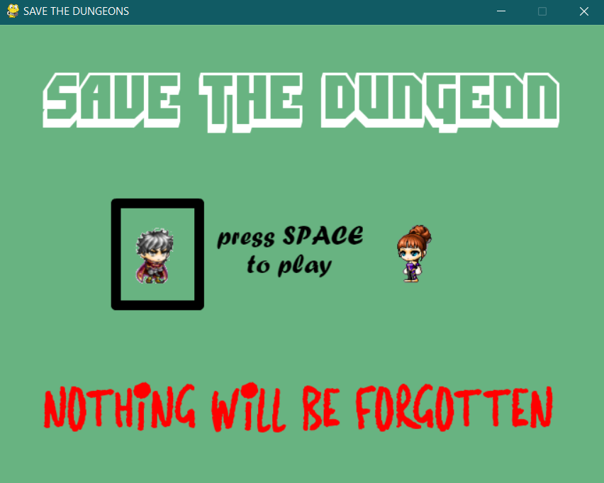

# Save the Dungeon

This project is my FIRST game that I developed for the BACCALAUREAT. **I received a grade of 20/20 by the jury.**

## Compilation & Execution

Since the time i presented it, _the project deteriorated a bit: loss of files, draft code..._ So for now, when 
you executed it : You can have somme errors during the game (crash, bug). I will try to fix this when I can

For launch the game, execute the STV.py

## What is Save The Dungeon

Save The Dungeon (STV) is **an RPG-style game**. You are a knight (Men or Women, you choose at the start) belonging to a guild. 
You are given a mission: To visit the king of the neighbouring kingdom who has problems. Your mates are already gone.
But on the road, you will have some problems against a group of evil magicians who captured your friends and you.

## The mechanic of choice

When I was developing this game, I was inspired by Until Dawn and Shadow of War : Until dawn is an horror game in which, the player make choices who
impact the history and end of the game. Shadow of war is a game in which the player have a real liberty in his gameplay. **So I tried to integrate to STV some choice and gave at the player a liberty** 
**on his gameplay**. For example, the player can end the history and save none of his friends, or save just some of them.
Also, he can avoid capture by not taking the main road. There are also choices in the dialogues !

### Other mechanic

The player can fight (Boss-Combat), can interact with map at some moment (Pickaxe for go out a jail), 
characters' movements are animated 

## ScreenShots

